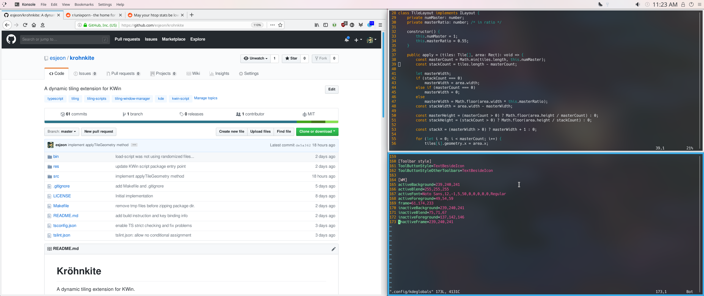

Kröhnkite
=========

A dynamic tiling extension for KWin.

Kröhnkite is mainly inspired by [dwm][] from suckless folks, and aims to be
"simple" in both development and usage.

[dwm]: https://dwm.suckless.org/
[Typescript]: https://www.typescriptlang.org/

Build & Install
---------------

You can install Kröhnkite in multiple ways.

The simplest method would be:

	make install

This will automatically build and install kwinscript package. Note that you can
manually build package file using `make package`. The generated package file
can be imported from "KWin Script" dialog in "System Settings".

If you don't want to install the script, but still want to try, you can:

	make run
	make stop

to temporarily load (and unload) the script to KWin. You may also want to
restart KWin w/:

	kwin_x11 --replace

New instance will replace the current one, and print debugging message(i.e.
`console.log`) to terminal. This is useful for testing and debugging.

Default Key Bindings
--------------------

| Key               | Action                         |
| ----------------- | ------------------------------ |
| Meta + J          | Focus Down/Next                |
| Meta + K          | Focus Up/Previous              |
| Meta + H          | Left                           |
| Meta + L          | Right                          |
|                   |                                |
| Meta + Shift + J  | Move Down/Next                 |
| Meta + Shift + K  | Move Up/Previous               |
| Meta + Shift + H  | Move Left                      |
| Meta + Shift + L  | Move Right                     |
|                   |                                |
| Meta + I          | Increase                       |
| Meta + D          | Decrease                       |
| Meta + F          | Toggle Floating                |
| Meta + \          | Cycle Layout                   |

Useful Development Resources
----------------------------

 * [KWin Scripting Tutorial](https://techbase.kde.org/Development/Tutorials/KWin/Scripting)
 * [KWin Scripting API 4.9 Reference](https://techbase.kde.org/Development/Tutorials/KWin/Scripting/API_4.9)
 * KDE API Reference
    - [KWin::Workspace Class](https://api.kde.org/4.x-api/kde-workspace-apidocs/kwin/html/classKWin_1_1Workspace.html)
    - [KWin::Toplevel Class](https://api.kde.org/4.x-api/kde-workspace-apidocs/kwin/html/classKWin_1_1Toplevel.html)
    - [KWin::Client Class](https://api.kde.org/4.x-api/kde-workspace-apidocs/kwin/html/classKWin_1_1Client.html)

