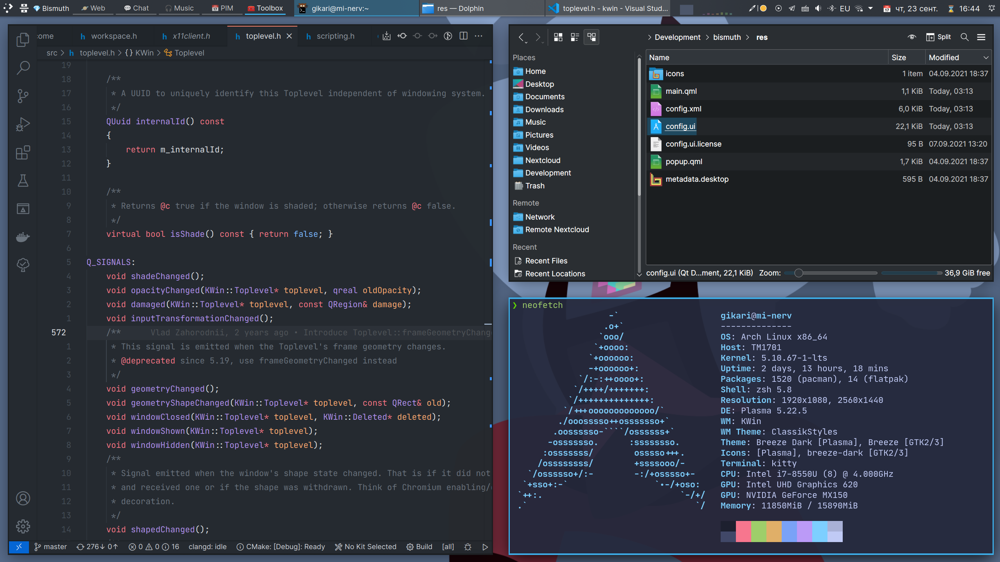
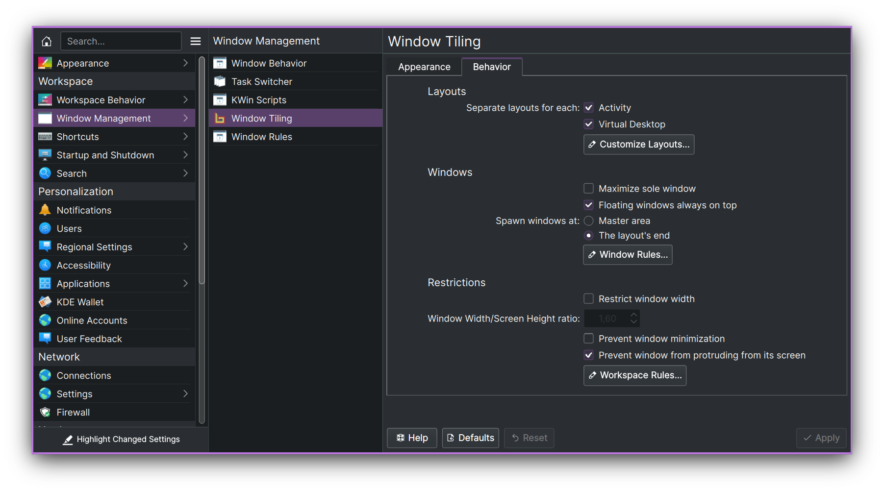

<!--
  SPDX-FileCopyrightText: 2021-2022 Mikhail Zolotukhin <mail@genda.life>
  SPDX-FileCopyrightText: 2018-2019 Eon S. Jeon <esjeon@hyunmu.am>
  SPDX-License-Identifier: MIT
-->

# 🌈 Bismuth 🌈

#### Making tiling window management easy. On KDE Plasma.

Arrange your windows in different grids to minimize the mouse usage.

## 🌟 Features 🌟

### Automatic window tiling

Save your time by automatically managing windows on your screen.

https://user-images.githubusercontent.com/14205339/148453685-f1bcfa46-4952-4b9d-a6f1-d2d75a0b4992.mp4

 

### Plasma integration

Power-up your workflow using native Plasma features - Virtual Desktops and
Activities.

https://user-images.githubusercontent.com/14205339/148562411-c9cca82a-c694-4794-b5e4-8fe716ec3d98.mp4

 

### Multiple Layouts

Use different layouts in different contexts.

https://user-images.githubusercontent.com/14205339/148564378-1def9350-a871-4f75-ba66-7a59ea1d4680.mp4

 
 
 

## 🏁 Getting Started

### Requirements

- A Linux distribution with KDE Plasma version 5.23 or higher
- Qt version 5.15 or higher
- KDE Frameworks version 5.80 or higher

You can check if your system matches these requirements by going to System
Settings > About this System.

### Installation

:warning: Distributions' packages are not affiliated with Bismuth developers.
If you encounter any issues with the incorrect installation, you should
contact the package maintainer first.

#### Arch Linux

- [AUR](https://aur.archlinux.org/packages/kwin-bismuth)

#### Debian

- [Volian Repository](https://volian.org/bismuth/)

#### Ubuntu

- [Volian Repository](https://volian.org/bismuth/)

#### Fedora

- [Capucho Copr](https://copr.fedorainfracloud.org/coprs/capucho/bismuth)

#### OpenSUSE Tumbleweed

- [home:rxmd OBS Repository](https://build.opensuse.org/package/show/home:rxmd/kwin-script-tiling-bismuth)

#### Gentoo

- [VipreML Overlay](https://github.com/viperML/viperML-overlay/)

#### From Source

- [See Dev Docs](CONTRIBUTING.md)

If you know a packaging solution for a distribution, that is not in the
list, please open a pull request.

### Usage

🎉 To start using Bismuth enable it in System Settings > Window Management >
Window Tiling.

⌨️ You can view the shortcuts in System Settings > Shortcuts > KWin. (The
shortcuts, introduced by the project, will have the `Bismuth:` prefix). If you
used Krohnkite before, you can import some of its shortcuts using [the bash
script](cotrib/import_krohnkite.sh).

🔧 If you want, you may also make a couple of manual fixes and tweaks to
improve your experience with window tiling. See [Tweaks
section](contrib/README.md).

### Configuration

You can configure Bismuth in the System Settings > Window Management > Window Tiling.

## 🤝 Acknowledgments

This project was made possible because of the hard work of other people on [Krohnkite
KWin Tiling Script](https://github.com/esjeon/krohnkite).
